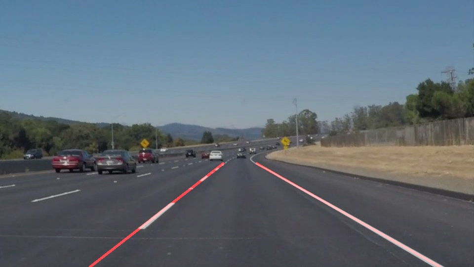
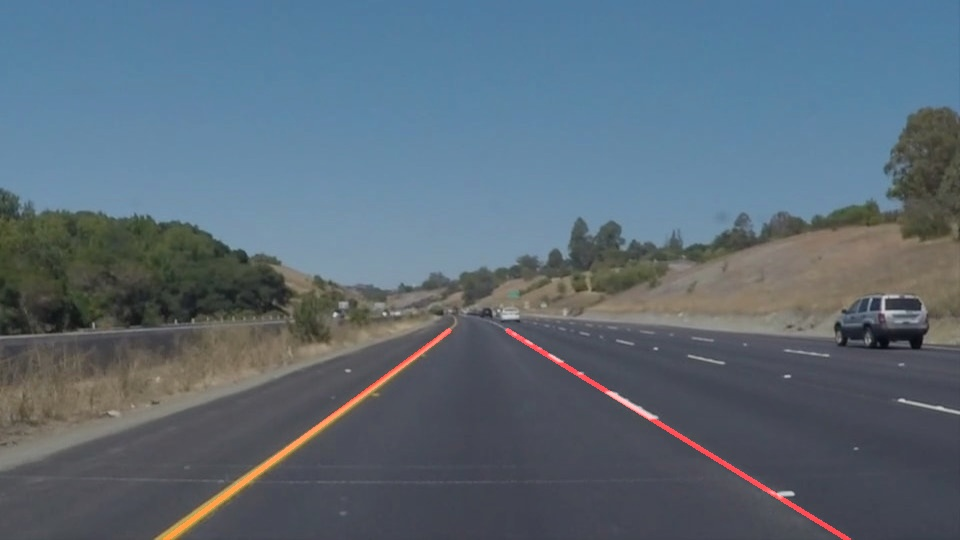
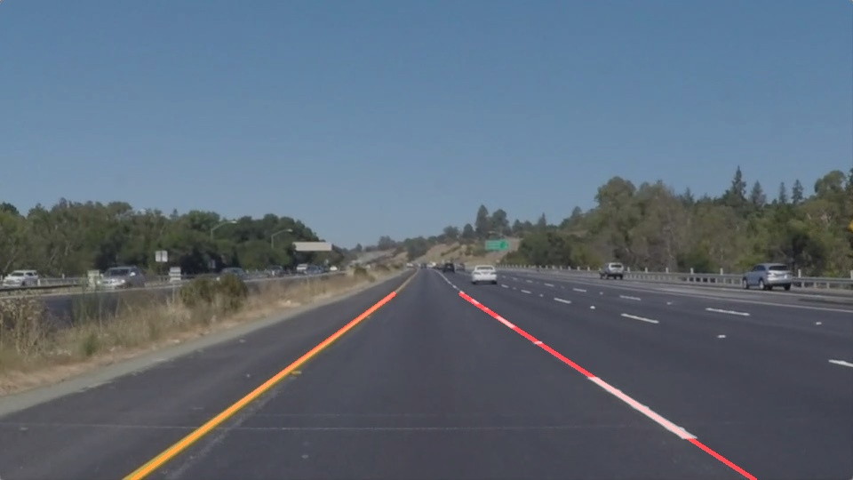
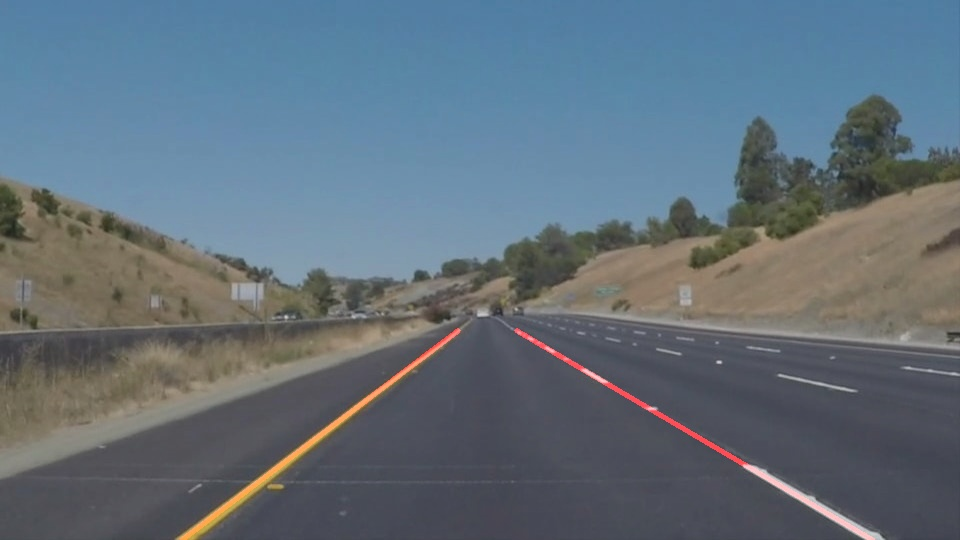

# **Finding Lane Lines on the Road** 
[](http://www.udacity.com/drive)


Overview
---

When we drive, we use our eyes to decide where to go.  The lines on the road that show us where the lanes are act as our constant reference for where to steer the vehicle.  Naturally, one of the first things we would like to do in developing a self-driving car is to automatically detect lane lines using an algorithm.

In this project you will detect lane lines in images using Python and OpenCV.  OpenCV means "Open-Source Computer Vision", which is a package that has many useful tools for analyzing images.  

To complete the project, two files will be submitted: a file containing project code and a file containing a brief write up explaining your solution. We have included template files to be used both for the [code](https://github.com/udacity/CarND-LaneLines-P1/blob/master/P1.ipynb) and the [writeup](https://github.com/udacity/CarND-LaneLines-P1/blob/master/writeup_template.md).The code file is called P1.ipynb and the writeup template is writeup_template.md 

To meet specifications in the project, take a look at the requirements in the [project rubric](https://review.udacity.com/#!/rubrics/322/view)

The first procedure to get image processing is having some tools to make everything work.


# PIPELINE


### Jupyter notebooks

Jupyter is a well known environment/Framework to do some of the work involved.

To install it use:

```python
pip3 install jupyter
```

You can also check the tool in general and docs related [here  in this link](https://jupyter.readthedocs.io/en/latest/index.html ). 

### Anaconda

Anaconda is also a great environment for all the tools related in this type of projects so you can check these environment to install and work [here](https://docs.anaconda.com/anaconda/install/).

Some packages can be installed as easy as this, which is interesting for some math tools and other that we'll be using.

```python
conda install package-name
```


### OPENCV

OpenCV means "Open-Source Computer Vision" which is a package that has many useful tools for analyzing images.  
My recommendation is to install the ver. 3.0 for some cases it might be better to have the most recent version.

To install and read other docs for reference check [OpenCV for Linux](https://docs.opencv.org/master/d7/d9f/tutorial_linux_install.htm)


### Gray image

The first step in order to see the different variables for the environment we have is to make image a gray one, in that way we can make the image ready to use for other purposes in image processing, because it makes easier later stages.


Command to use

```python
cv2.cvtColor(img, cv2.COLOR_RGB2GRAY)
```

https://github.com/carlosagudelo/CarND-LaneLines-P1/blob/master/test_images/output_edges_solidWhiteCurve.jpg

https://github.com/carlosagudelo/CarND-LaneLines-P1/blob/master/test_images/output_gray_solidYellowCurve2.jpg

https://github.com/carlosagudelo/CarND-LaneLines-P1/blob/master/test_images/output_gray_solidYellowLeft.jpg


### Canny Edge Detector

Using the tool canny edge we can have an image that is closer to something that we can have as part of the identifier or track lane detector, in this case the use of canny edge function will lead to an environment of shapes when we have this type of images we can track easily the track path and other parts of the image.

```python
cv2.Canny(img, low_threshold, high_threshold)
```

As you can see the images below this part of the process makes an image black with shapes.


https://github.com/carlosagudelo/CarND-LaneLines-P1/blob/master/test_images/output_edges_solidWhiteCurve.jpg


https://github.com/carlosagudelo/CarND-LaneLines-P1/blob/master/test_images/output_edges_solidYellowLeft.jpg

But this is the first real way to identify the different changes in the image.

For example the deffinition of line is a succession of points, so here you can see that this is the first really effective way to make and detect lines.


### Hough lines

OpenCV has some other tools that will help us to make better deffinitions of the different spaces and changes in the image.

The hough lines usefs a transformation in the cartesian plane, making the standard notation (x,y,z) a different notation known as hough transform which will convert the image into a (rho, theta) image almost like a polar coordinate that you see in a transformed plane.


> Hough Lines


> Formula


> Hough Plane


### IMG SHAPE

Another important step is to maje definitions on the image, the way opencv handles the images is a little bit different from standard image processing, so you’ll see some changes in the axes, this is important as this is part of the future processing.


Add image of the cartesian plane in open cv


### Area of interest

After this is very important to define the areas of interest which lead to make a better definition on the actual edges of focus to make a better processing.

This is as important as other process because you can define the area of interest and the shapes the car will have in front, through the image processing.


Finally we have something close to an output of the image, but in this case we have a not completely defined line and in order to detect the best area of intrest into the image, we might use some tools to make a complete line in the area of interest.

For that you can use some tools from numpy and math processing, to make a linear regression with the points  that are part of each side of the area of interest, in the left side and in the right side.

The simplest way to do it is to save each point of each side, the take advantage of standard math and then make recalculation of the lines.

In this case I did like this only for illustrative reasons, but you can actually use as described before the tools from numpy to make math processing.

After this I complete the main task which is related to have a track lane recognition for images.









https://github.com/carlosagudelo/CarND-LaneLines-P1/blob/master/test_images/output_solidWhiteCurve.jpg


Check videos in source to see the results.

[VIDEO FOLDER](https://github.com/carlosagudelo/CarND-LaneLines-P1/tree/master/test_videos_output)


For the challenge I did some extra processing, which I tried and read before as a way to make better imeage processing and this is using an extra stage of coloring the image in order to see better the changes in different leves in each image, so the easiest way to do it is through  HSL filters, but also I realized that the image has this errors due to its increasing changes in the surrounded area, meaning that the way the image was captured and processed does not apply necessarily in every scenario, so it needs to have better way of processing.


## Improvements on the current pipeline

1. The maths implied: certainly there are better tools and more simplier to use here, that is the first improvement to do.

2. The image processing is basic for now this is just coloring, and shapes, but keep in mind that images somehow have a camera implied and cameras in most or ethier are affected by lens or affected by software, so this part of the way everything can be improved here.


